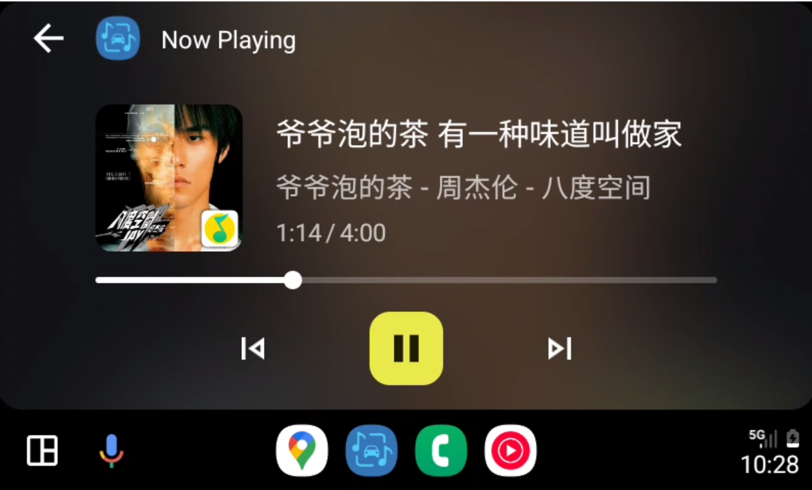
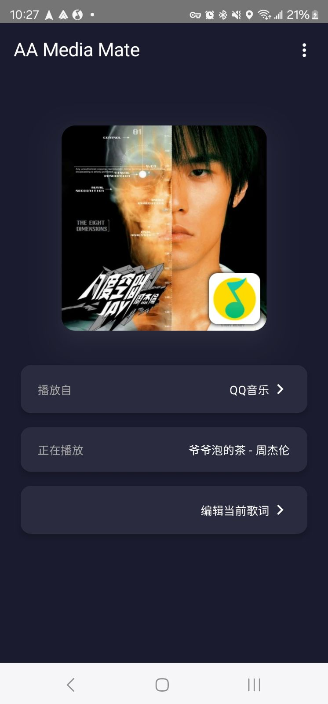
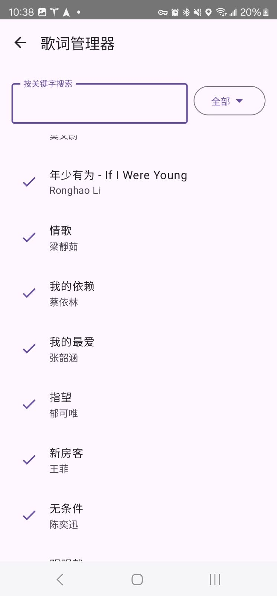
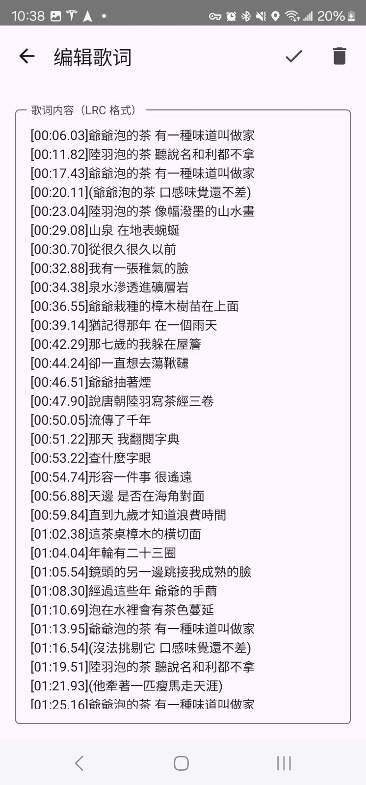

# AAMediaMate 

    

[For README in English](README_en.md)

 **AAMediaMate (Android Auto Media Mate)** 是一款用于 Android Auto 的媒体桥接工具，可以将当前正在手机上播放的音乐信息同步到车载屏幕上，并支持基础的播放控制与可选的歌词同步功能。

本App主要功能与Readme由ChatGPT辅助编写，Logo由Gemini辅助生成。

---

## 📱 功能简介

- 🛰️ 桥接正在播放的音乐 App（无须 App 原生支持 Android Auto）
- ⏯️ 支持基础控制：播放、暂停、上一首、下一首
- 🎤 可选支持歌词显示，通过Android Auto的歌名显示滚动歌词
- 📱 手机端主界面支持管理歌词缓存、修改设置

---

## ⚠️ 使用说明与限制

- 本 App 的主要目标是**桥接未支持 Android Auto 的音乐 App**，如 QQ 音乐、网易云音乐、酷狗音乐等。  
  若某 App 原生已支持 Android Auto（如 YouTube Music），本App也可以实现控制及歌词显示，但需要先调整设置。

- 本 App 通过通知监听和媒体 Session 获取播放信息，请务必授权对应权限，否则将无法正常使用。

---

## ⚠️ 安全提示

🚗 **不建议驾驶时使用歌词显示功能。**  
请在驻车或作为乘客时使用歌词功能，确保行车安全！

---

## ⚙️ 歌词设置

AAMediaMate 支持两个歌词源，默认启用 Musixmatch，如需切换请前往「设置」页面。

### 1️⃣ Musixmatch (via [RapidAPI](https://rapidapi.com/musixmatchcom/api/musixmatch-lyrics-songs))

**设置方法：**

1. 访问 [RapidAPI 页面](https://rapidapi.com/Paxsenix0/api/musixmatch-lyrics-songs/playground)
2. 注册或登录 RapidAPI 账号
3. 获取你的 `X-RapidAPI-Key`
4. 在 AAMediaMate 设置中粘贴该 Key

**注意：** 免费额度有限（约每月 500 次）

---

### 2️⃣ [LrcApi](https://github.com/HisAtri/LrcApi)

社区提供的开源歌词 API,
无需配置 API Key，但需要手动设置API地址。参阅[LrcApi](https://github.com/HisAtri/LrcApi)文档设置公开API或自己搭建服务器

---

## 🛠️ 使用方式

1. 下载 Release 页面的 APK 安装到手机
2. 授权通知监听权限（首次启动时会提示）
3. 打开 App 主界面，可查看当前桥接的媒体信息
4. 使用 Android Auto 车机端选择 AAMediaMate 作为媒体来源
5. 播放任意支持的音乐 App，AAMediaMate 将自动同步元数据与封面

---

## 📂 下载发布版 APK

请前往 [Releases 页面](https://github.com/gululu1235/AAMediaMate/releases) 下载最新版 APK  
（建议通过浏览器访问，确保已允许「安装未知来源的应用」）

---

## 📄 开源协议

本项目基于 [Apache License 2.0](LICENSE) 开源发布，欢迎二次开发与贡献。

---

## 🙏 鸣谢

- [ChatGPT](https://chatgpt.com/)
- [Gemini](https://gemini.google.com/app)
- [Musixmatch Lyrics API](https://rapidapi.com/musixmatchcom/api/musixmatch-lyrics-songs)
- [LrcApi by @HisAtri](https://github.com/HisAtri/LrcApi)

---

## 📷 截图

### Android Auto效果

### 手机端主界面

    

### 歌词管理

---
欢迎反馈建议或提交 Issue！  
