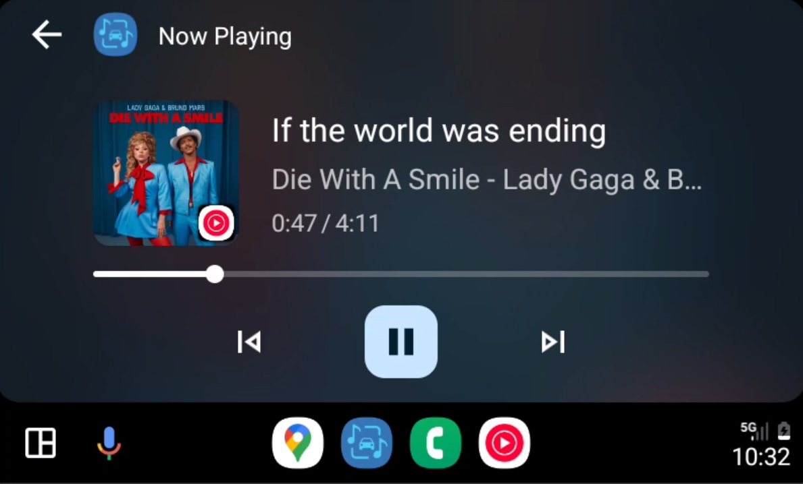
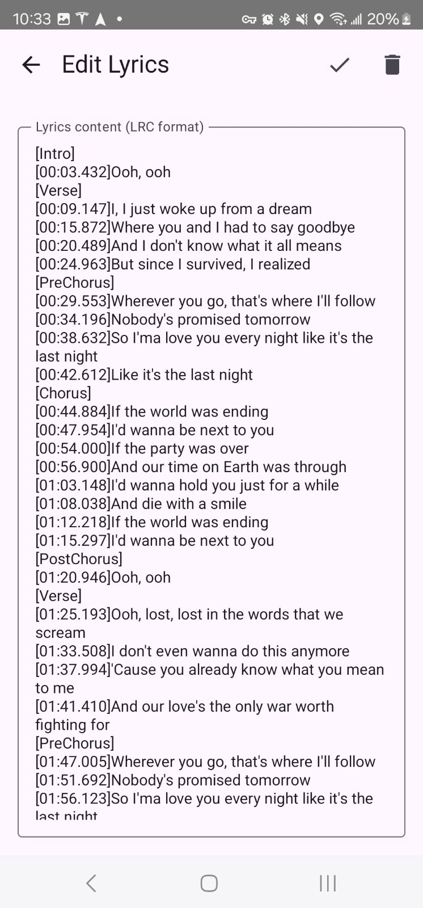

# AAMediaMate

    

**AAMediaMate (Android Auto Media Mate)** is a media bridge tool designed for Android Auto. It syncs the currently playing music information from your phone to your car screen, supports basic playback controls, and offers optional lyrics display.

This app and its README were written with the help of ChatGPT, and the logo was generated using Gemini.

---

## 📱 Features

- 🛰️ **Bridge Music Apps** that do *not* natively support Android Auto (e.g., QQ Music, NetEase Cloud Music)
- ⏯️ **Basic Controls**: Play, Pause, Next, Previous
- 🎤 **Optional Lyrics Display**, shown as song title scroll text on Android Auto
- 📱 **Phone Interface** for managing lyrics cache and settings

---

## ⚠️ Usage & Limitations

- This app is primarily designed to **bridge music apps that don't support Android Auto**, such as Youtube, QQ Music, NetEase Cloud Music.  
  It can still work with apps that already support Android Auto (e.g., YouTube Music) by disabling "Ignore Native Android Auto Players" in settings.

- The app uses notification listeners and media session APIs to extract playback info. Please make sure the necessary permissions are granted, or the app will not work properly.

---

## ⚠️ Safety Notice

🚗 **Do NOT use the lyrics display feature while driving.**  
Please use it only when parked or as a passenger to ensure road safety.

---

## ⚙️ Lyrics Configuration

AAMediaMate supports two lyrics sources. The default is **Musixmatch**, and you can switch between providers in the app settings.

### 1️⃣ Musixmatch (via [RapidAPI](https://rapidapi.com/Paxsenix0/api/musixmatch-lyrics-songs/))

**Setup Instructions:**

1. Visit the [RapidAPI Page](https://rapidapi.com/Paxsenix0/api/musixmatch-lyrics-songs/)
2. Register or log in to your RapidAPI account
3. Copy your `X-RapidAPI-Key`
4. Paste it into AAMediaMate settings

**Note:** Free quota is limited (~500 requests/month)

---

### 2️⃣ [LrcApi](https://github.com/HisAtri/LrcApi/blob/main/README_EN.md)

A community-provided open-source lyrics API mainly for Chinese lyrics.  
No API key required, but you need to manually configure the API URL. See the [LrcApi docs](https://github.com/HisAtri/LrcApi/blob/main/README_EN.md#public-api) for public API endpoints or self-hosting instructions.

---

## 🛠️ How to Use

1. Download the APK from the [Releases Page](https://github.com/gululu1235/AAMediaMate/releases)
2. Grant notification listener permission (you will be prompted on first launch)
3. Open the app on your phone to view current playback information
4. On Android Auto, select AAMediaMate as the media source
5. Play music in any supported app — AAMediaMate will automatically sync metadata and cover art

---

## 📂 Download APK

Go to the [Releases Page](https://github.com/gululu1235/AAMediaMate/releases) to download the latest APK.  
(Browser recommended. Please ensure “Install from unknown sources” is enabled in your device settings.)

---

## 📄 License

This project is open-sourced under the [Apache License 2.0](LICENSE). Contributions and forks are welcome!

---

## 🙏 Acknowledgments

- [ChatGPT](https://chatgpt.com/)
- [Gemini](https://gemini.google.com/app)
- [Musixmatch Lyrics API](https://rapidapi.com/musixmatchcom/api/musixmatch-lyrics-songs)
- [LrcApi by @HisAtri](https://github.com/HisAtri/LrcApi)

---

## 📷 Screenshots

### Android Auto Lyrics Display

### Mobile App Main Screen

    

### Lyrics Manager

---

Feel free to submit issues or feature requests!
